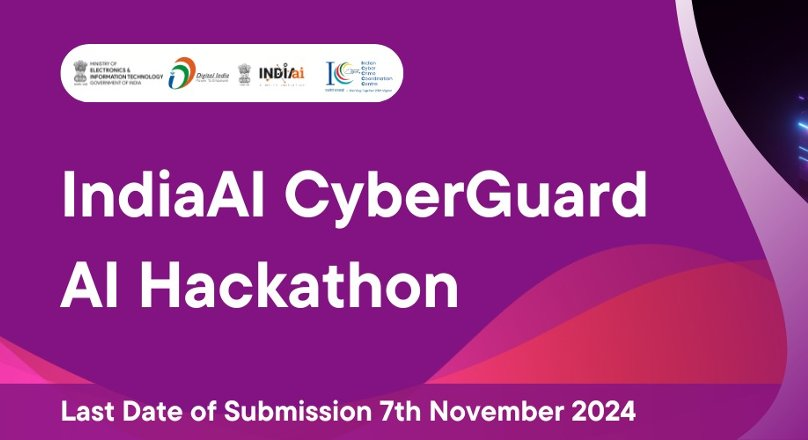

# IndiaAI CyberGuard AI Hackathon Submission



## Netra - AI-Powered Cybercrime Classification System

[](https://www.python.org/downloads/)
[](LICENSE)
[](https://scikit-learn.org/)

## Overview

Netra is an advanced cybercrime classification system that uses Natural Language Processing (NLP) to automatically categorize cybercrime complaints. Built for the IndiaAI CyberGuard Hackathon, it employs dual Random Forest classifiers to simultaneously predict both main categories and subcategories of cybercrime incidents.

## Key Features

- Dual-classification system with 89.5% accuracy
- Advanced text preprocessing pipeline
- Production-ready with comprehensive error handling
- Automated model retraining capabilities
- Privacy-preserving feature extraction

## Quick Start

### Prerequisites

- Python 3.8+
- pip package manager
- Poetry package manager

### Installation

```bash
# Clone the repository
git clone https://github.com/yourusername/netra.git
cd netra

# Create and activate virtual environment
poetry shell

# Install dependencies
poetry install
```

### Basic Usage

```python
from netra.classifier import CybercrimeClassifier

# Initialize the classifier
classifier = CybercrimeClassifier()

# Predict category for a complaint
text = "Someone created a fake profile using my photos on Instagram"
category, subcategory = classifier.predict(text)
```

## Requirements

```text
python = "^3.11"
nltk = "^3.9.1"
pandas = "^2.2.3"
scikit-learn = "^1.5.2"
seaborn = "^0.13.2"
numpy = "^2.1.2"
```

## Contact

For any queries or support:
- Email: chiragaggarwal5k@gmail.com
- GitHub Issues: [Create an issue](https://github.com/yourusername/netra/issues)