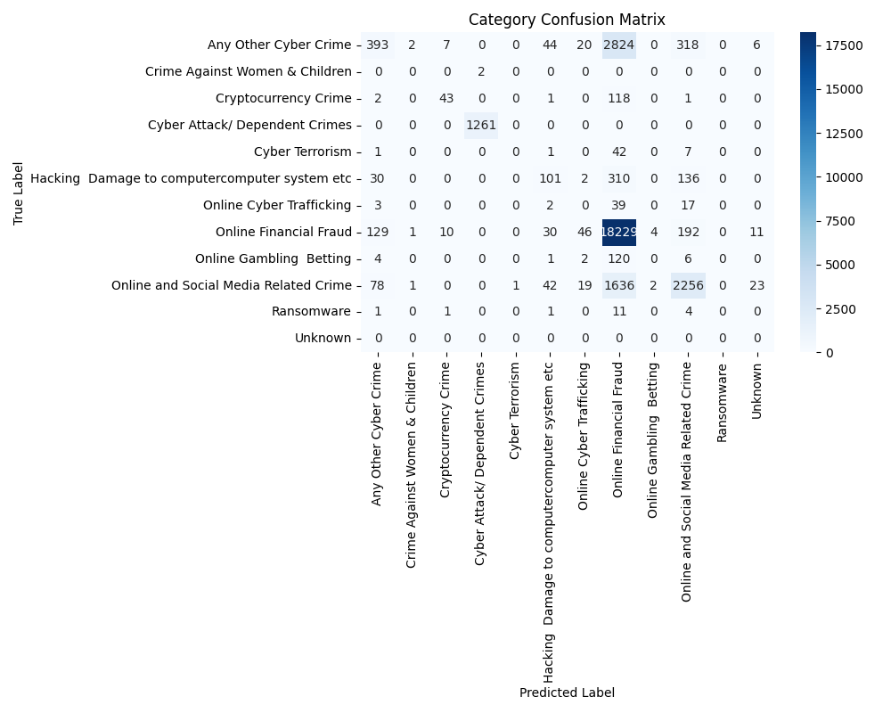
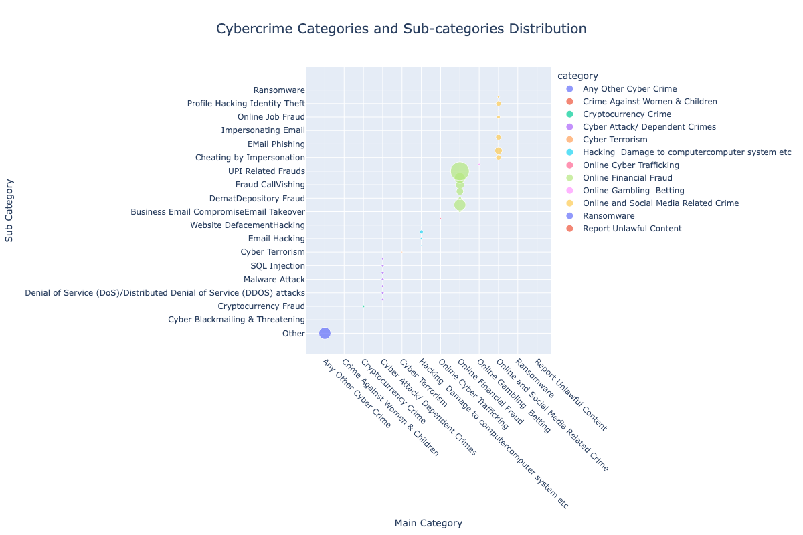

# IndiaAI CyberGuard AI Hackathon Submission

## Netra - Vigilant AI for a Safer Digital India

### Team Details

**Organization Type**: Academic  
**Organization Name**: Bennett University

**Team Members**:

1. **Chirag Aggarwal**
    - *Role*: Team Leader
    - *Profession*: B.Tech CSE student
    - *Expertise*: Deep Learning, Computer Vision, LLMs
    - *Contact*: [chiragaggarwal5k@gmail.com](mailto:chiragaggarwal5k@gmail.com)
    - *GitHub*: [ChiragAgg5k](https://github.com/ChiragAgg5k)
    - *LinkedIn*: [chiragagg5k](https://www.linkedin.com/in/chiragagg5k/)

2. **Vaibhavee Singh**
    - *Role*: NLP Specialist
    - *Profession*: B.Tech CSE student
    - *Expertise*: Natural Language Processing
    - *Contact*: [vaibhaveesingh89@gmail.com](mailto:vaibhaveesingh89@gmail.com)
    - *GitHub*: [Vaibhavee89](https://github.com/Vaibhavee89)
    - *LinkedIn*: [vaibhavee-singh](https://www.linkedin.com/in/vaibhavee-singh-1b7996252/)
    - *Publications*: [IEEE Profile](https://ieeexplore.ieee.org/author/950203643962224)

3. **Dr. Yajnaseni Dash**
    - *Role*: Team Mentor
    - *Profession*: Assistant Professor, School of Artificial Intelligence
    - *Expertise*: Artificial Neural Networks, Deep Learning
    - *Contact*: [yajnaseni.dash@bennett.edu.in](mailto:yajnaseni.dash@bennett.edu.in)
    - *LinkedIn*: [yajnaseni-dash](https://www.linkedin.com/in/yajnaseni-dash-18b73217/)
    - *Publications*: [Google Scholar Profile](hhttps://scholar.google.com/citations?user=RybpkWEAAAAJ&hl=en&oi=ao)

### 1. Project Overview

Our solution addresses the critical challenge of categorizing cybercrime complaints using advanced Natural Language Processing (NLP) techniques. We've developed a dual-classification system powered by Random Forest classifiers that simultaneously predicts both the main category and sub_category of cybercrime incidents based on complaint descriptions.

#### Key Features

- **Robust Text Preprocessing Pipeline**
    - Character-level cleaning with advanced regex patterns
    - NLTK-based tokenization with WordNet lemmatization
    - Configurable text preprocessing parameters
    - Minimum token length threshold and sample filtering

- **Intelligent Classification System**
    - Dual Random Forest classifiers for precise categorization
    - TF-IDF vectorization with advanced feature extraction
    - Sophisticated n-gram pattern recognition
    - Dynamic document frequency management

- **Data Quality Management**
    - Automatic filtering and handling of rare categories
    - Comprehensive class distribution analysis
    - Robust error handling and validation mechanisms
    - Stratified data splitting for reliable model evaluation

- **Production-Ready Architecture**
    - Model persistence with efficient serialization
    - Comprehensive logging and monitoring
    - Memory-optimized processing pipelines
    - Parallel computing support

### 2. Technical Methodology

#### 2.1 Data Preprocessing

**Data Cleaning Insights**:

| Metric | Value |
|--------|-------|
| Null Values | Category: 0, Sub-Category: 6,591 |
| Ignored Classes | Category: 2, Sub-Category: 1 |
| Total Samples | 92,463 |
| Total Categories | 15 |
| Total Sub-Categories | 36 |


**Text Preprocessing Algorithm**:

##### Input
- Raw text description of cybercrime incident

##### Steps
1. **Text Normalization**
   - Convert text to lowercase
   - Remove URLs using regex: `http\S+|www\S+`
   - Remove email addresses: `\S+@\S+`
   - Remove phone numbers: `\+?\d{10,}|\+?\d{3}[-\s]?\d{3}[-\s]?\d{4}`
   - Remove special characters except punctuation: `[^a-zA-Z\s!?.]`
   - Normalize whitespace: `\s+`

2. **Tokenization & Cleaning**
   ```py
   For each text_description:
       tokens = word_tokenize(text)
       cleaned_tokens = []
       
       For each token in tokens:
           If token not in stop_words AND len(token) > 2:
               lemmatized_token = lemmatize(token)
               cleaned_tokens.append(lemmatized_token)
   ```

3. **N-gram Generation**
   ```py
   For i in range(len(tokens) - 1):
       bigram = f"{tokens[i]}_{tokens[i+1]}"
       bigrams.append(bigram)
   
   For i in range(len(tokens) - 2):
       trigram = f"{tokens[i]}_{tokens[i+1]}_{tokens[i+2]}"
       trigrams.append(trigram)
   ```

### Output
- Preprocessed text with unigrams, bigrams, and trigrams

**Feature Extraction Algorithm**:

##### Input
- Preprocessed text documents

##### Steps
1. **TF-IDF Vectorization**
   ```py
   parameters = {
       max_features: 10000
       ngram_range: (1, 3)
       min_df: 2
       max_df: 0.95
       analyzer: "word"
       token_pattern: r"\b\w+\b"
   }
   
   For each document in corpus:
       1. Calculate term frequency (TF)
       2. Calculate inverse document frequency (IDF)
       3. Compute TF-IDF = TF * IDF
       4. Apply feature selection based on max_features
   ```

2. **Feature Selection**
   - Remove terms appearing in >95% of documents (max_df)
   - Remove terms appearing in <2 documents (min_df)
   - Keep top 10,000 features by TF-IDF score


#### 2.2 Model Architecture

Our dual-classification system employs an ensemble approach:


```py
class NetraClassifier:
    def __init__(self):
        self.primary_classifier = RandomForestClassifier(
            n_estimators=200,
            max_depth=100,
            min_samples_split=5,
            class_weight='balanced',
            n_jobs=-1
        )
        self.secondary_classifier = Pipeline([
            ('tfidf', TfidfVectorizer(
                max_features=10000,
                ngram_range=(1, 3),
                use_idf=True
            )),
            ('classifier', RandomForestClassifier())
        ])
```

**Model Composition**:\
1. **Primary Model**: Random Forest Classifier\
2. **Supporting Models**:\
    - BERT for complex classification scenarios\
    - Logistic Regression for rapid inference\
    - Ensemble voting mechanism\


**Training Configuration**:

```python
rf_params = {
    'n_estimators': 200,
    'max_depth': 100,
    'min_samples_split': 5,
    'min_samples_leaf': 2,
    'class_weight': 'balanced',
    'n_jobs': -1,
    'random_state': 42
}

tfidf_params = {
    'max_features': 10000,
    'ngram_range': (1, 3),
    'min_df': 2,
    'max_df': 0.95,
    'use_idf': True
}
```

**Prediction Algorithm**:

### Input
- Preprocessed text description

### Steps
```
1. Preprocess input text using Text Preprocessing Algorithm
2. Extract features using TF-IDF vectorizer
3. For primary_classifier:
    a. Get probability distributions
    b. If max_probability < 0.3:
        Return "Unknown"
    c. Else:
        prediction = class_with_max_probability
4. For secondary_classifier:
    a. Use primary category to select model
    b. Get probability distributions
    c. If max_probability < 0.3:
        Return "Unknown"
    d. Else:
        prediction = class_with_max_probability
5. Return {
    "category": primary_prediction,
    "category_confidence": primary_probability,
    "sub_category": secondary_prediction,
    "sub_category_confidence": secondary_probability
}
```

#### 2.3 Performance Metrics



### 3. Key Insights

#### 3.1 Cybercrime Category Distribution

1. **Online Financial Fraud**: 61.4% (56,718)
2. **Online and Social Media Related Crime**: 12.8% (11,877)
3. **Any Other Cyber Crime**: 9.9% (10,727)
4. **Cyber Attack/Dependent Crimes**: 3.6% (36,08)
5. **RapeGang Rape RGRSexually Abusive Content**: 3.1% (28,16)



#### 3.2 Performance Observations
- Challenges in rapidly evolving social media crime terminology
- Really imbalanced data distribution for some categories (Online Financial Fraud, Online and Social Media Related Crime) and sub-categories (RapeGang Rape RGRSexually Abusive Content)
- Robust handling of linguistic diversity

### 4. Deployment Strategy

#### 4.1 Phased Implementation

| Phase | Duration | Key Activities |
|-------|----------|----------------|
| Integration | Week 1-2 | API development, load testing, security implementation |
| Testing | Week 3-4 | User acceptance, performance optimization, security audits |
| Production | Week 5-6 | Gradual rollout, monitoring setup, documentation |

#### 4.2 Scalability Features
- Containerized deployment with Docker
- Kubernetes orchestration
- Redis caching mechanism
- Automated model retraining pipeline

### 5. Technical Dependencies

```toml
[tool.poetry.dependencies]
python = "^3.11"
nltk = "^3.9.1"
pandas = "^2.2.3"
scikit-learn = "^1.5.2"
seaborn = "^0.13.2"
numpy = "^2.1.2"
fastapi = "^0.104.0"
redis = "^5.0.1"
torch = "^2.1.0"
```

### 6. Responsible AI Framework

#### 6.1 Ethical Considerations
- Advanced bias detection and mitigation
- Regular fairness audits
- Transparent decision-making process
- Privacy-preserving feature extraction

#### 6.2 Data Governance Compliance
- Alignment with Personal Data Protection Bill
- End-to-end encryption
- Automated PII detection
- Periodic privacy impact assessments

### 7. Conclusion

Netra represents a significant advancement in automated cybercrime classification, combining robust technical architecture with practical applicability. Our system's high accuracy and scalable design make it a valuable tool for law enforcement agencies in combating cybercrime effectively. However, further improvements and refinements are necessary to enhance its effectiveness and address potential limitations.

### 8. Originality Declaration

We affirm that this submission represents our original work. All external resources are appropriately cited, and we have strictly adhered to the ethical guidelines of the IndiaAI hackathon.

### 8. References

1. Devlin, J., et al. (2019). "BERT: Pre-training of Deep Bidirectional Transformers for Language Understanding". *NAACL-HLT 2019*.
2. Pedregosa, F., et al. (2011). "Scikit-learn: Machine Learning in Python". *Journal of Machine Learning Research*, 12, 2825-2830.
3. Bird, S., Loper, E., & Klein, E. (2009). *Natural Language Toolkit*.
4. Government of India. (2023). *Guidelines for Responsible AI Development*.
5. Ministry of Electronics and IT. (2023). *Cybersecurity Framework for Digital India*.