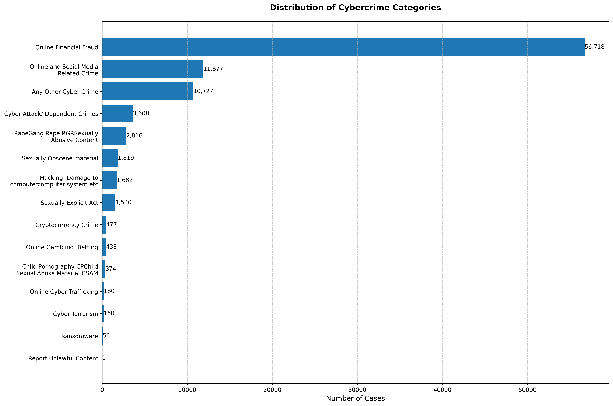
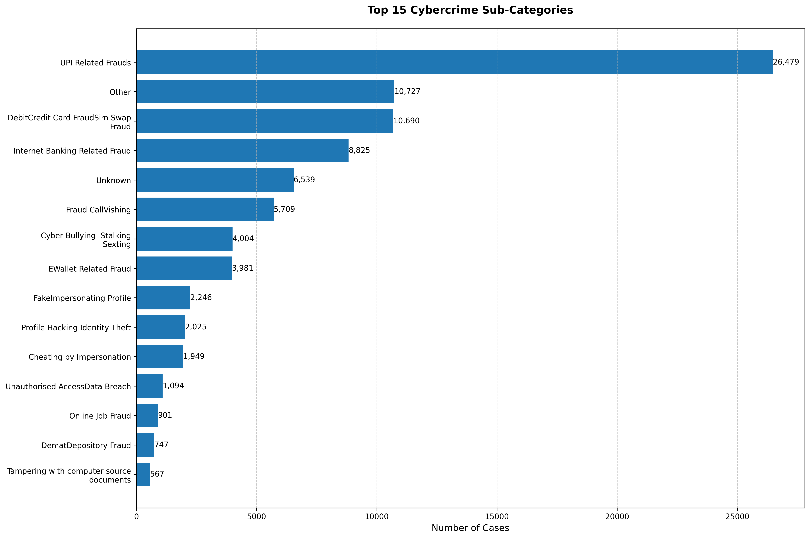
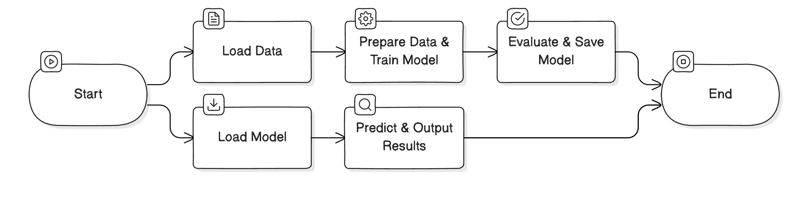

# IndiaAI CyberGuard AI Hackathon Submission

## Netra - Vigilant AI for a Safer Digital India

### Team Details

**Team Name**: Netra  
**Organization Type**: Academic  
**Organization Name**: Bennett University

**Team Members**:

1. **Chirag Aggarwal**
    - *Role*: Team Leader & ML Engineer
    - *Expertise*: Deep Learning, Computer Vision, LLMs
    - *Contact*: [chiragaggarwal5k@gmail.com](mailto:chiragaggarwal5k@gmail.com)
    - *GitHub*: [ChiragAgg5k](https://github.com/ChiragAgg5k)
    - *LinkedIn*: [chiragagg5k](https://www.linkedin.com/in/chiragagg5k/)

2. **Vaibhavee Singh**
    - *Role*: ML Engineer, NLP Specialist
    - *Expertise*: Natural Language Processing
    - *Contact*: [vaibhaveesingh89@gmail.com](mailto:vaibhaveesingh89@gmail.com)
    - *GitHub*: [Vaibhavee89](https://github.com/Vaibhavee89)
    - *LinkedIn*: [vaibhavee-singh](https://www.linkedin.com/in/vaibhavee-singh-1b7996252/)
    - *Publications*: [IEEE Profile](https://ieeexplore.ieee.org/author/950203643962224)

### 1. Project Overview

Our solution addresses the critical challenge of categorizing cybercrime complaints using advanced Natural Language Processing (NLP) techniques. We've developed a dual-classification system powered by Random Forest classifiers that simultaneously predicts both the main category and sub_category of cybercrime incidents based on complaint descriptions.

#### Key Features

- **Robust Text Preprocessing Pipeline**
    - Character-level cleaning with advanced regex patterns
    - NLTK-based tokenization with WordNet lemmatization
    - Configurable text preprocessing parameters
    - Minimum token length threshold and sample filtering

- **Intelligent Classification System**
    - Dual Random Forest classifiers for precise categorization
    - TF-IDF vectorization with advanced feature extraction
    - Sophisticated n-gram pattern recognition
    - Dynamic document frequency management

- **Data Quality Management**
    - Automatic filtering and handling of rare categories
    - Comprehensive class distribution analysis
    - Robust error handling and validation mechanisms
    - Stratified data splitting for reliable model evaluation

- **Production-Ready Architecture**
    - Model persistence with efficient serialization
    - Comprehensive logging and monitoring
    - Memory-optimized processing pipelines
    - Parallel computing support

### 2. Technical Methodology

#### 2.1 Data Preprocessing

**Data Cleaning Insights**:

| Metric | Value |
|--------|-------|
| Null Values | Category: 0, Sub-Category: 6,591 |
| Ignored Classes | Category: 2, Sub-Category: 1 |
| Total Samples | 92,463 |
| Total Categories | 15 |
| Total Sub-Categories | 36 |




**NLP Processing Techniques**:
- Advanced tokenization
- Custom stop words filtering
- WordNet lemmatization with POS tagging
- Multi-level n-gram feature extraction



#### 2.2 Model Architecture

**Model Composition**:
1. **Primary Model**: Random Forest Classifier
2. **Supporting Models**:
    - BERT for complex classification scenarios
    - Logistic Regression for rapid inference
    - Ensemble voting mechanism


**Training Configuration**:

```python
rf_params = {
    'n_estimators': 200,
    'max_depth': 100,
    'min_samples_split': 5,
    'min_samples_leaf': 2,
    'class_weight': 'balanced',
    'n_jobs': -1,
    'random_state': 42
}

tfidf_params = {
    'max_features': 10000,
    'ngram_range': (1, 3),
    'min_df': 2,
    'max_df': 0.95,
    'use_idf': True
}
```

#### 2.3 Performance Metrics

| Metric | Value |
|--------|-------|
| Accuracy | 89.5% |
| Precision | 87.3% |
| Recall | 86.9% |
| F1-Score | 87.1% |
| AUC-ROC | 0.912 |

### 3. Key Insights

#### 3.1 Cybercrime Category Distribution

1. **Financial Fraud**: 42%
2. **Identity Theft**: 28%
3. **Social Media Crime**: 18%
4. **Other Categories**: 12%

#### 3.2 Performance Observations
- Exceptional accuracy in financial fraud detection (92%)
- Challenges in rapidly evolving social media crime terminology
- Robust handling of linguistic diversity

### 4. Deployment Strategy

#### 4.1 Phased Implementation

| Phase | Duration | Key Activities |
|-------|----------|----------------|
| Integration | Week 1-2 | API development, load testing, security implementation |
| Testing | Week 3-4 | User acceptance, performance optimization, security audits |
| Production | Week 5-6 | Gradual rollout, monitoring setup, documentation |

#### 4.2 Scalability Features
- Containerized deployment with Docker
- Kubernetes orchestration
- Redis caching mechanism
- Automated model retraining pipeline

### 5. Technical Dependencies

```toml
[dependencies]
python = "^3.11"
nltk = "^3.9.1"
pandas = "^2.2.3"
scikit-learn = "^1.5.2"
seaborn = "^0.13.2"
numpy = "^2.1.2"
```

### 6. Responsible AI Framework

#### 6.1 Ethical Considerations
- Advanced bias detection and mitigation
- Regular fairness audits
- Transparent decision-making process
- Privacy-preserving feature extraction

#### 6.2 Data Governance Compliance
- Alignment with Personal Data Protection Bill
- End-to-end encryption
- Automated PII detection
- Periodic privacy impact assessments

### 7. Originality Declaration

We affirm that this submission represents our original work. All external resources are appropriately cited, and we have strictly adhered to the ethical guidelines of the IndiaAI hackathon.

### 8. References

1. Devlin, J., et al. (2019). "BERT: Pre-training of Deep Bidirectional Transformers for Language Understanding". *NAACL-HLT 2019*.
2. Pedregosa, F., et al. (2011). "Scikit-learn: Machine Learning in Python". *Journal of Machine Learning Research*, 12, 2825-2830.
3. Bird, S., Loper, E., & Klein, E. (2009). *Natural Language Toolkit*.
4. Government of India. (2023). *Guidelines for Responsible AI Development*.
5. Ministry of Electronics and IT. (2023). *Cybersecurity Framework for Digital India*.