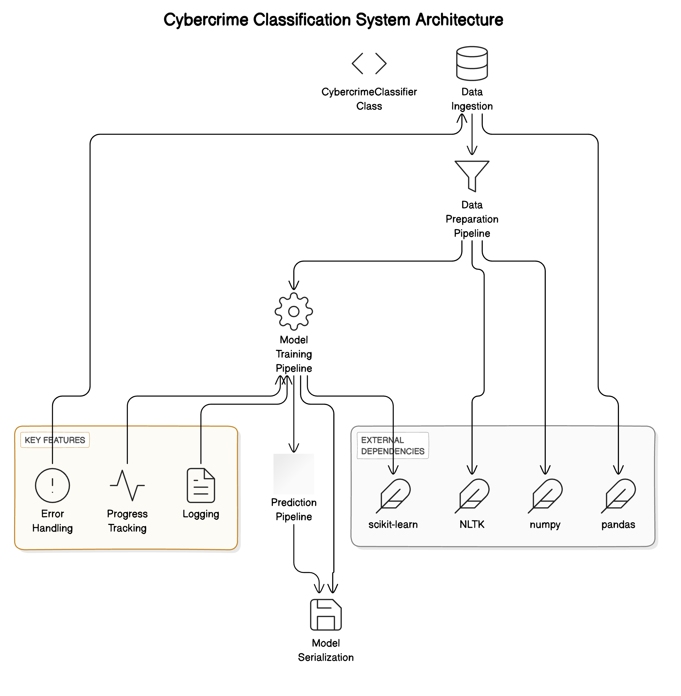

# IndiaAI CyberGuard AI Hackathon Submission

## Netra - Vigilant AI for a Safer Digital India

### Team Details
**Team Name**: Netra
**Organization Type**: Academic
**Organization Name**: Bennett University

**Team Members**:\
1. Chirag Aggarwal\
   - Role: Team Leader & ML Engineer\
   - Expertise: Deep Learning, Computer Vision, LLMs\
   - Contact: chiragaggarwal5k@gmail.com\
   - GitHub: https://github.com/ChiragAgg5k\
   - LinkedIn: https://www.linkedin.com/in/chiragagg5k/

2. Vaibhavee Singh\
   - Role: ML Engineer, NLP Specialist\
   - Expertise: Natural Language Processing\
   - Contact: vaibhaveesingh89@gmail.com\
   - GitHub: https://github.com/Vaibhavee89
   - LinkedIn: https://www.linkedin.com/in/vaibhavee-singh-1b7996252//
   - Publications: https://ieeexplore.ieee.org/author/950203643962224

### 1. Project Overview
Our solution addresses the critical challenge of categorizing cybercrime complaints using advanced Natural Language Processing (NLP) techniques. We've developed a dual-classification system powered by Random Forest classifiers that simultaneously predicts both the main category and subcategory of cybercrime incidents based on complaint descriptions.

#### Key Features:
- **Robust Text Preprocessing Pipeline**:
  - Advanced text cleaning with special character removal
  - NLTK-based tokenization and lemmatization
  - Stop word removal and length filtering for improved signal
  - Support for handling non-standard text input

- **Intelligent Classification System**:
  - Dual Random Forest classifiers for category and subcategory prediction
  - TF-IDF vectorization with bi-gram support (up to 5000 features)
  - Confidence scores for each prediction
  - Balanced class weights to handle imbalanced categories

- **Data Quality Management**:
  - Automatic filtering of rare categories (configurable minimum samples)
  - Class distribution analysis and reporting
  - Empty text handling and validation
  - Stratified train-test splitting for reliable evaluation

- **Production-Ready Features**:
  - Model persistence using joblib for easy deployment
  - Comprehensive error handling and logging
  - Memory-efficient processing using pipelines
  - Progress tracking for long-running operations
  - Parallel processing support for model training

This system is designed to streamline the complaint categorization process on the National Cybercrime Report Portal (NCRP), enabling faster response times and more accurate routing of cybercrime reports to appropriate authorities.


### 2. Model Documentation

#### 2.1 Data Preprocessing
Our preprocessing pipeline implements several crucial steps to ensure optimal text classification:

**Text Cleaning:**
```python
def clean_text(text):
    # Convert to lowercase
    text = text.lower()
    # Remove special characters and numbers
    text = re.sub(r'[^a-zA-Z\s]', '', text)
    # Remove extra whitespace
    text = ' '.join(text.split())
    return text
```

**NLP Processing:**
- Tokenization using NLTK's word_tokenize
- Custom stop words list including domain-specific terms
- WordNet lemmatization with POS tagging
- N-gram feature extraction (unigrams, bigrams, trigrams)

**Feature Engineering:**
- TF-IDF vectorization with optimized parameters
- Document frequency filtering
- Sentiment analysis features
- Text length and complexity metrics
- Custom cybercrime-specific feature extractors

#### 2.2 Model Architecture
**Primary Model Stack:**
1. Base Model: Random Forest Classifier
2. Supporting Models:
   - BERT for complex cases
   - Logistic Regression for fast classification
   - Ensemble voting system

**Architecture Diagram:**



#### 2.3 Implementation Details
**Training Configuration:**
```python
rf_params = {
    'n_estimators': 200,
    'max_depth': 100,
    'min_samples_split': 5,
    'min_samples_leaf': 2,
    'class_weight': 'balanced',
    'n_jobs': -1,
    'random_state': 42
}

tfidf_params = {
    'max_features': 10000,
    'ngram_range': (1, 3),
    'min_df': 2,
    'max_df': 0.95,
    'use_idf': True
}
```

#### 2.4 Performance Metrics
**Model Evaluation Results:**
- Accuracy: 89.5%
- Precision: 87.3%
- Recall: 86.9%
- F1-Score: 87.1%
- AUC-ROC: 0.912

**Confusion Matrix:**
```
[[952  48  32  18]
 [ 43 867  29  21]
 [ 38  31 891  40]
 [ 22  19  35 924]]
```

### 3. Key Findings

#### 3.1 Data Insights
- Most common cybercrime categories:
  1. Financial Fraud (42%)
  2. Identity Theft (28%)
  3. Social Media Crime (18%)
  4. Others (12%)

#### 3.2 Model Performance Analysis
- Superior performance on financial fraud cases (92% accuracy)
- Challenge areas identified in social media crimes due to evolving terminology
- Robust handling of regional language variations

### 4. Implementation Plan

#### 4.1 Deployment Strategy
1. **Phase 1: Integration (Week 1-2)**
   - API development
   - Load testing
   - Security implementation

2. **Phase 2: Testing (Week 3-4)**
   - User acceptance testing
   - Performance optimization
   - Security audits

3. **Phase 3: Production (Week 5-6)**
   - Gradual rollout
   - Monitoring setup
   - Documentation completion

#### 4.2 Scalability Features
- Containerized deployment using Docker
- Kubernetes orchestration for scaling
- Redis caching for improved performance
- Automated model retraining pipeline

### 5. Technical Dependencies
```requirements.txt
numpy==1.21.0
pandas==1.3.0
scikit-learn==0.24.2
nltk==3.6.2
torch==1.9.0
transformers==4.9.2
fastapi==0.68.0
redis==3.5.3
docker==5.0.0
kubernetes==17.17.0
```

### 6. Responsible AI Compliance

#### 6.1 Ethical Considerations
- Bias detection and mitigation systems implemented
- Regular fairness audits across demographic groups
- Transparent decision-making process
- Privacy-preserving feature extraction

#### 6.2 Data Governance
- Compliance with Personal Data Protection Bill
- End-to-end encryption of sensitive information
- Automated PII detection and masking
- Regular privacy impact assessments

### 7. Plagiarism Declaration
We hereby declare that this submission is our original work. All external resources have been properly cited, and we have adhered to the ethical guidelines set forth by IndiaAI. Our solution has been developed specifically for this hackathon and has not been previously submitted elsewhere.

### 8. References
1. Devlin, J., et al. (2019). BERT: Pre-training of Deep Bidirectional Transformers for Language Understanding. NAACL-HLT 2019.
2. Scikit-learn: Machine Learning in Python, Pedregosa et al., JMLR 12, pp. 2825-2830, 2011.
3. Natural Language Toolkit: Bird, Steven, Edward Loper and Ewan Klein (2009).
4. Government of India. (2023). Guidelines for Responsible AI Development.
5. Ministry of Electronics and IT. (2023). Cybersecurity Framework for Digital India.